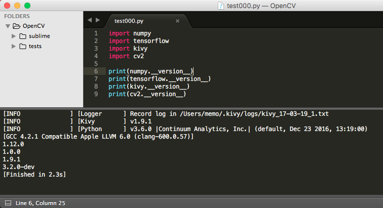
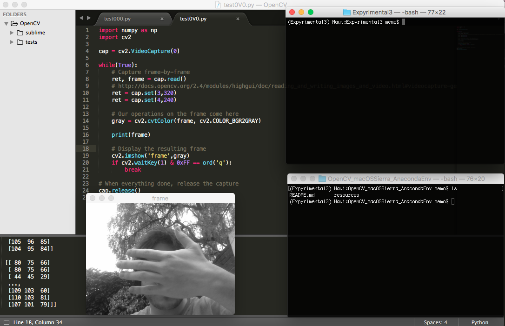

# OpenCV_macOSSierra_AnacondaEnv

# macOS Sierra + OpenCV + Anaconda + Sublime Text 

## In English from region 1

I love to experiment and break things appart, at the end, my OS is always pay the prize and at some point, I always find myself having to do a backup and a clean install to continue experimenting so, for my future self, and anyone who could be interested in take something of this an use it as he/she pleased, can do it.

I will follow Adrian Rosebrock tutorial, pucblished past December 2016 and I hope he does not get mad about it for taking it as a reference, this is an update and is focused in anaconda environments for the simple reason I am currently working with them at the time and I found the possibility of isolate opencv to just one anaconda environmet, after some tests I hope to update this to also compile tensorflow instead of using the wheel from pip.

The Installation process is in the jupyter notebook in this repo, just go to it an it will render fine in any explorer.

I am also ading some examples from the openCV site, the sublime project and the yaml file to create the environmet where I am currently writing this.

Tutorial from where I take reference ...
http://www.pyimagesearch.com/2016/12/05/macos-install-opencv-3-and-python-3-5/

Adrian Rosebrock (the author)...
http://www.pyimagesearch.com/author/adrian/

reference links ...
macOS Sierra
http://www.apple.com/lae/macos/sierra/

openCV
http://opencv.org

anaconda
https://www.continuum.io/downloads

sublime
https://www.sublimetext.com

My machine:
Macbook pro mid 2012 ( 13-inch )
2.5 Ghz Intel Core i5 ( 4 cores )
8 GB 1600 Mhx DDR3
Intel HD Graphics 4000 1536 MB ( sorry no CUDA :( )
macOS Sierra 10.12.3

## En Español de la región 4

Me encanta experimentar y romper cosas, al final mi sistema operativo siempre paga el precio y en algún momento me veo en la necesidad de hacer un respaldo y hacer una instalacion limpia de mi preparacion para poder seguir experimentando, así que, para mi futuro yo y cualquier persona a la que quizá le interese tomar algo de aqui y usarlo como el guste, pueda hacerlo. ( Además es mi último día de vacaciones ) 

Me baso en el tutorial de Adrian Rosebrock publicado el pasado Diciembre del 2016 y espero que no se enoje por tomar la referencia, esto es una actualizacion y se enfoca en anaconda y no en virtualenv por la razon de que en este momento me encuentro trabajando así y me parece genial la idea de poder aislar la compilacion de openCV al ambiente virtual, luego de unas pruebas espero actualizar esto para tambien compilar tensorflow en vez de usar el wheel que viene en pip.

El tutorial esta en el archivo de Jupyter solo accede a el y se vera bien en cualquier explorador.

He agregado varios ejemplos del sitio de openCV, el proyecto de sublime, y el archivo yaml para crear el ambiente desde el cual hago este ejemplo. 

Tutorial de donde me baso ...
http://www.pyimagesearch.com/2016/12/05/macos-install-opencv-3-and-python-3-5/

Adrian Rosebrock (el autor del tutorial)...
http://www.pyimagesearch.com/author/adrian/

Links de referencia ...
macOS Sierra
http://www.apple.com/lae/macos/sierra/

openCV
http://opencv.org

anaconda
https://www.continuum.io/downloads

sublime
https://www.sublimetext.com

Mi maquina:
Macbook pro mid 2012 ( 13-inch )
2.5 Ghz Intel Core i5 ( 4 cores )
8 GB 1600 Mhx DDR3
Intel HD Graphics 4000 1536 MB ( lo siento no CUDA :( )
macOS Sierra 10.12.3

  

